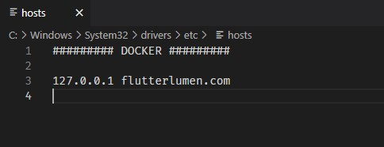

## Guide

Install **[Node](https://nodejs.org/es/)**, **[PHP](https://www.php.net/downloads)**, **[Composer](https://getcomposer.org/)** and **[Docker Desktop](https://docker.com/products/docker-desktop/).**

Open **Docker Desktop**, then with CMD launch this commands

    cd docker
    docker-compose up -d

In *laravelVue* folder we must to copy-paste *env.example* and rename new file as *.env*. In this file we must to set your database connections.

Default connection in *.env* file for this project.

    DB_CONNECTION=mysql
    DB_HOST=mariadb
    DB_PORT=3306
    DB_DATABASE=flutterlumen
    DB_USERNAME=root
    DB_PASSWORD=secret

After all we can edit *etc/host* file to use a domain name.

We can access to the web in localhost (127.0.0.1) or in flutterlumen.com.

### Frontend

### Backend